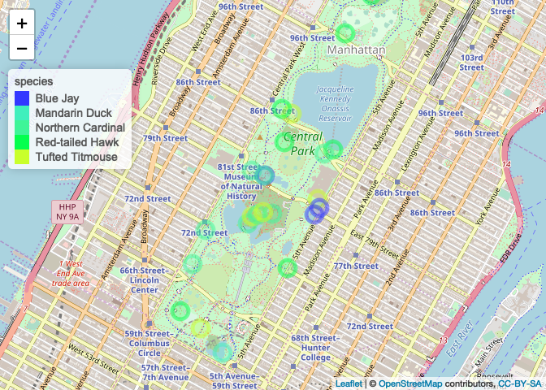
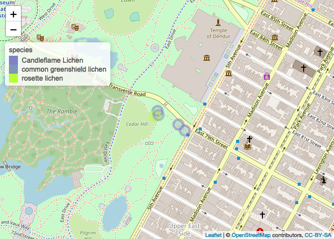

CentralPark
================
Ilya
3/2/2019

##### install packages

    ## 
    ## Attaching package: 'data.table'

    ## The following object is masked from 'package:raster':
    ## 
    ##     shift

    ## Loading required package: lattice

    ## Loading required package: ggplot2

    ## 
    ## Attaching package: 'lubridate'

    ## The following objects are masked from 'package:data.table':
    ## 
    ##     hour, isoweek, mday, minute, month, quarter, second, wday,
    ##     week, yday, year

    ## The following object is masked from 'package:base':
    ## 
    ##     date

    ## Loading required package: rgdal

    ## rgdal: version: 1.3-9, (SVN revision 794)
    ##  Geospatial Data Abstraction Library extensions to R successfully loaded
    ##  Loaded GDAL runtime: GDAL 2.1.3, released 2017/20/01
    ##  Path to GDAL shared files: /Library/Frameworks/R.framework/Versions/3.4/Resources/library/rgdal/gdal
    ##  GDAL binary built with GEOS: FALSE 
    ##  Loaded PROJ.4 runtime: Rel. 4.9.3, 15 August 2016, [PJ_VERSION: 493]
    ##  Path to PROJ.4 shared files: /Library/Frameworks/R.framework/Versions/3.4/Resources/library/rgdal/proj
    ##  Linking to sp version: 1.3-1

    ## 
    ## Attaching package: 'dplyr'

    ## The following objects are masked from 'package:lubridate':
    ## 
    ##     intersect, setdiff, union

    ## The following objects are masked from 'package:data.table':
    ## 
    ##     between, first, last

    ## The following objects are masked from 'package:raster':
    ## 
    ##     intersect, select, union

    ## The following objects are masked from 'package:stats':
    ## 
    ##     filter, lag

    ## The following objects are masked from 'package:base':
    ## 
    ##     intersect, setdiff, setequal, union

    ## Loading required package: Matrix

    ## rgeos version: 0.4-2, (SVN revision 581)
    ##  GEOS runtime version: 3.6.1-CAPI-1.10.1 
    ##  Linking to sp version: 1.3-1 
    ##  Polygon checking: TRUE

    ## Loading required package: deldir

    ## deldir 0.1-15

    ## Loading required package: ade4

    ## Loading required package: adehabitatMA

    ## 
    ## Attaching package: 'adehabitatMA'

    ## The following object is masked from 'package:raster':
    ## 
    ##     buffer

    ## Loading required package: adehabitatLT

    ## Loading required package: CircStats

    ## Loading required package: MASS

    ## 
    ## Attaching package: 'MASS'

    ## The following object is masked from 'package:dplyr':
    ## 
    ##     select

    ## The following objects are masked from 'package:raster':
    ## 
    ##     area, select

    ## Loading required package: boot

    ## 
    ## Attaching package: 'boot'

    ## The following object is masked from 'package:lattice':
    ## 
    ##     melanoma

    ## 
    ## Attaching package: 'adehabitatLT'

    ## The following object is masked from 'package:dplyr':
    ## 
    ##     id

    ## 
    ## Attaching package: 'magrittr'

    ## The following object is masked from 'package:raster':
    ## 
    ##     extract

    ## Loading required package: survival

    ## 
    ## Attaching package: 'survival'

    ## The following object is masked from 'package:boot':
    ## 
    ##     aml

    ## The following object is masked from 'package:caret':
    ## 
    ##     cluster

    ## Loading required package: splines

    ## Loading required package: parallel

    ## Loaded gbm 2.1.3

    ## 
    ## Attaching package: 'geojsonio'

    ## The following object is masked from 'package:base':
    ## 
    ##     pretty

    ## Linking to GEOS 3.6.1, GDAL 2.1.3, PROJ 4.9.3

    ## Loading required package: snowfall

    ## Loading required package: snow

    ## 
    ## Attaching package: 'snow'

    ## The following objects are masked from 'package:parallel':
    ## 
    ##     clusterApply, clusterApplyLB, clusterCall, clusterEvalQ,
    ##     clusterExport, clusterMap, clusterSplit, makeCluster,
    ##     parApply, parCapply, parLapply, parRapply, parSapply,
    ##     splitIndices, stopCluster

    ## Loading required package: fields

    ## Loading required package: spam

    ## Loading required package: dotCall64

    ## Loading required package: grid

    ## Spam version 2.1-4 (2018-04-12) is loaded.
    ## Type 'help( Spam)' or 'demo( spam)' for a short introduction 
    ## and overview of this package.
    ## Help for individual functions is also obtained by adding the
    ## suffix '.spam' to the function name, e.g. 'help( chol.spam)'.

    ## 
    ## Attaching package: 'spam'

    ## The following object is masked from 'package:Matrix':
    ## 
    ##     det

    ## The following objects are masked from 'package:base':
    ## 
    ##     backsolve, forwardsolve

    ## Loading required package: maps

    ## See www.image.ucar.edu/~nychka/Fields for
    ##  a vignette and other supplements.

#### read in protected area data. source: <https://gapanalysis.usgs.gov/padus/data/download/>

``` r
path = "PAD/"
PAD = shapefile(paste0(path,
                       "PADUS1_4Combined.shp"))

PAD_wgs84 <- spTransform(PAD, CRS("+proj=longlat +datum=WGS84"))
```

    ## Warning in Polygon(coords = crds): less than 4 coordinates in polygon

    ## Warning in Polygon(coords = crds): less than 4 coordinates in polygon

    ## Warning in Polygon(coords = crds): less than 4 coordinates in polygon

    ## Warning in Polygon(coords = crds): less than 4 coordinates in polygon

    ## Warning in Polygon(coords = crds): less than 4 coordinates in polygon

    ## Warning in Polygon(coords = crds): less than 4 coordinates in polygon

    ## Warning in Polygon(coords = crds): less than 4 coordinates in polygon

``` r
#assign cooordinates (package: sp)
PAD_coordinates = coordinates(PAD_wgs84)

PAD_wgs84$X = PAD_coordinates[,1]
PAD_wgs84$Y = PAD_coordinates[,2]

save(PAD_wgs84, file = "PAD_wgs84.Rdata")


# state = "NY"
# shp_state = subset(shp, State_Nm == state)
# 
# #change datum
# proj_new = "+proj=longlat +datum=WGS84 +no_defs+ellps=WGS84 +towgs84=0,0,0"
# 
# shp_transform <- spTransform(shp_state, CRS(proj_new))
# 
# #assign cooordinates (package: sp)
# PAD_coordinates = coordinates(shp_transform)
# 
# shp_transform$X = PAD_coordinates[,1]
# shp_transform$Y = PAD_coordinates[,2]

# uname = sort(shp_state$Loc_Nm)
# 
# loc = "Central Park"#this is smaller than "YELL"
# 
# sh p_loc = subset(shp_state, Loc_Nm == loc)
# save(shp_loc, file = "shp_loc.Rdata")
```

iNaturalist data
----------------

#### get records for each species from iNaturalist

``` r
# ## Return records from iNaturalist

#this gives too large bounding box
# load("shp_loc.Rdata")
# proj_new = "+proj=longlat +datum=WGS84 +no_defs+ellps=WGS84 +towgs84=0,0,0"
# #https://stackoverflow.com/questions/30018098/how-to-convert-utm-coordinates-to-lat-and-long-in-r
# shp_loc_t <- spTransform(shp_loc, CRS(proj_new))
# #projection(shp_loc) <- CRS()
# #bbox_tmp = bbox(shp_loc_t)
# bbox = as.data.frame(bbox(shp_loc_t))

out = NULL

#look up bounding box on google maps
#this only got two records, so expanded to NYC
ymax = 40.765765
ymin = 40.765516
xmax = -73.948257
xmin = -73.982301

#https://www.flickr.com/places/info/2459115
xmin= -74.2589
xmax = -73.7004
ymin = 40.4774
ymax = 40.9176
sppinat <- get_inat_obs(year = 2019, month = 2, maxresults = 100000,
                        bounds = c(ymin,xmin,ymax,xmax))

sppinat_spdf = sppinat
#turn it into a SpatialPointsDataFrame

#turn it into a SpatialPointsDataFrame
coordinates(sppinat_spdf) <- c("longitude","latitude")#package sp

# sppinat_spdf = SpatialPointsDataFrame(coords = sppinat[,c("longitude", "latitude")], 
#                                data = sppinat)


projection(sppinat_spdf) <- projection(PAD_wgs84)

sppinat_spdf$park <- over(sppinat_spdf, PAD_wgs84)$Unit_Nm#name of park

unique(sppinat_spdf$park)
```

    ##  [1] "Liberty"                                    
    ##  [2] NA                                           
    ##  [3] "Kissena Corridor West"                      
    ##  [4] "Bronx Park"                                 
    ##  [5] "Central Park"                               
    ##  [6] "Southern Nearshore Trap/Pot Waters"         
    ##  [7] "Silver Lake Park"                           
    ##  [8] "Prospect Park"                              
    ##  [9] "Mid-Atlantic Coastal Waters Area"           
    ## [10] "Van Cortlandt Park"                         
    ## [11] "Fort Tryon Park"                            
    ## [12] "Blue Heron Park Preserve"                   
    ## [13] "Riverside Park"                             
    ## [14] "Empire-Fulton Ferry"                        
    ## [15] "Flushing Meadows Corona Park"               
    ## [16] "LaTourette Park and Golf Course"            
    ## [17] "Cunningham Park"                            
    ## [18] "Gateway National Recreation Area"           
    ## [19] "Hudson River Park"                          
    ## [20] "Clove Lakes Park"                           
    ## [21] "Pelham Bay Park"                            
    ## [22] "Forest Park"                                
    ## [23] "Compensation Open Space"                    
    ## [24] "Saw Mill Creek - Compensati"                
    ## [25] "Alley Pond Park"                            
    ## [26] "Saw Mill Creek -compensatio"                
    ## [27] "Astoria Park"                               
    ## [28] "High Rock Park"                             
    ## [29] "Waters off New Jersey Closure"              
    ## [30] "Kissena Park"                               
    ## [31] "Riverbank"                                  
    ## [32] "Mount Loretto Unique Area"                  
    ## [33] "Saddle River County Park"                   
    ## [34] "Fort Washington Park"                       
    ## [35] "Conference House Park"                      
    ## [36] "Wolfes Pond Park"                           
    ## [37] "Inwood Hill Park"                           
    ## [38] "Baisley Pond Park"                          
    ## [39] "Highbridge Park"                            
    ## [40] "Statue Of Liberty National Monument"        
    ## [41] "Hamilton Grange National Memorial"          
    ## [42] "Randalls Island Park"                       
    ## [43] "Wards Island Park"                          
    ## [44] "Manhattan State Psychiatric Center"         
    ## [45] "Clay Pit Ponds"                             
    ## [46] "Crotona Park"                               
    ## [47] "Dreier-Offerman Park"                       
    ## [48] "William T Davis Wildlife Refuge"            
    ## [49] "Overpeck County Park"                       
    ## [50] "NYS Dept. of Environmental Conservation WET"
    ## [51] "East River Park"                            
    ## [52] "Bloomingdale Park"                          
    ## [53] "Marine Park"

``` r
#convert back to data.frame
sppinat_df = as.data.frame(sppinat_spdf)

  #remove duplicates if there are any
  occs.dups <- duplicated(sppinat_df[c('latitude', 'longitude', 'datetime')])
  sppinat_df <- sppinat_df[!occs.dups,]
  dim(sppinat_spdf)
```

    ## [1] 4211   37

``` r
inatCentralPark = subset(sppinat_df,
                         park == "Central Park")
#minimum fields: datetime, latitude, longitude, scientific_name
inatCentralPark = inatCentralPark[, c("common_name", "scientific_name", "datetime", "latitude", "longitude", "quality_grade", "user_login", "image_url")]

#fix datetime
inatCentralPark$datetime = strptime(inatCentralPark$datetime, format = "%Y-%m-%d %H:%M:%S", tz = "")
inatCentralPark$datetime = strftime(inatCentralPark$datetime, format = "%Y-%m-%d %H:%M:%S", tz = "", usetz = FALSE)
inatCentralPark$date = as.Date(inatCentralPark$datetime)
inatCentralPark$month = month(inatCentralPark$date)
inatCentralPark$year = year(inatCentralPark$date)
inatCentralPark$day = day(inatCentralPark$date)
inatCentralPark$hour = hour(inatCentralPark$datetime)
animal = c("American Robin", "Wood Duck", "Song Sparrow", "Northern Cardinal", "Mandarin Duck",
           "Red-tailed Hawk", "Downy Woodpecker",
           "White-breasted Nuthatch",
           "Tufted Titmouse", "Mallard", "Great Blue Heron", "Blue Jay")

CPBirds = subset(inatCentralPark, 
                 common_name %in% animal) 
save(CPBirds, file = "CPBirds.Rdata")
df_sum <- CPBirds %>% group_by(common_name) %>%
  summarize(count = n()) 

CPOneDayOneHour = subset(inatCentralPark, day == 28 & hour == 16 )
```

#### make map of 5 birds from iNaturalist

``` r
df <- CPBirds
df <- subset(df, common_name %in% c("Northern Cardinal", "Red-tailed Hawk", "Tufted Titmouse", "Mandarin Duck", "Blue Jay"))
factpal <- colorFactor(topo.colors(length(unique(df$common_name))), df$common_name)
zoom = 14
M<-    leaflet(df) %>%
      addTiles() %>%
       setView(lng = mean(df$longitude), lat = mean(df$latitude) , zoom =zoom) %>%
      addCircleMarkers(lng = df$longitude,
                       lat = df$latitude,
                 #color = color.vec[df$taxon_num],
                 color = ~factpal(common_name)) %>%
                    addLegend("topleft", pal = factpal, values = ~df$common_name, opacity = 1.0, title = "species")

mapshot(M, file = "central_park_birds.png")
M
```



#### make map of species recorded in iNaturalist in one hour

``` r
df <- CPOneDayOneHour
factpal <- colorFactor(topo.colors(length(unique(df$common_name))), df$common_name)
zoom = 16
M<-    leaflet(df) %>%
      addTiles() %>%
       setView(lng = mean(df$longitude), lat = mean(df$latitude) , zoom =zoom) %>%
      addCircleMarkers(lng = df$longitude,
                       lat = df$latitude,
                 #color = color.vec[df$taxon_num],
                 color = ~factpal(common_name)) %>%
                    addLegend("topleft", pal = factpal, values = ~df$common_name, opacity = 1.0, title = "species")

mapshot(M, file = "central_park_2019Feb28_1600.png")
M
```


